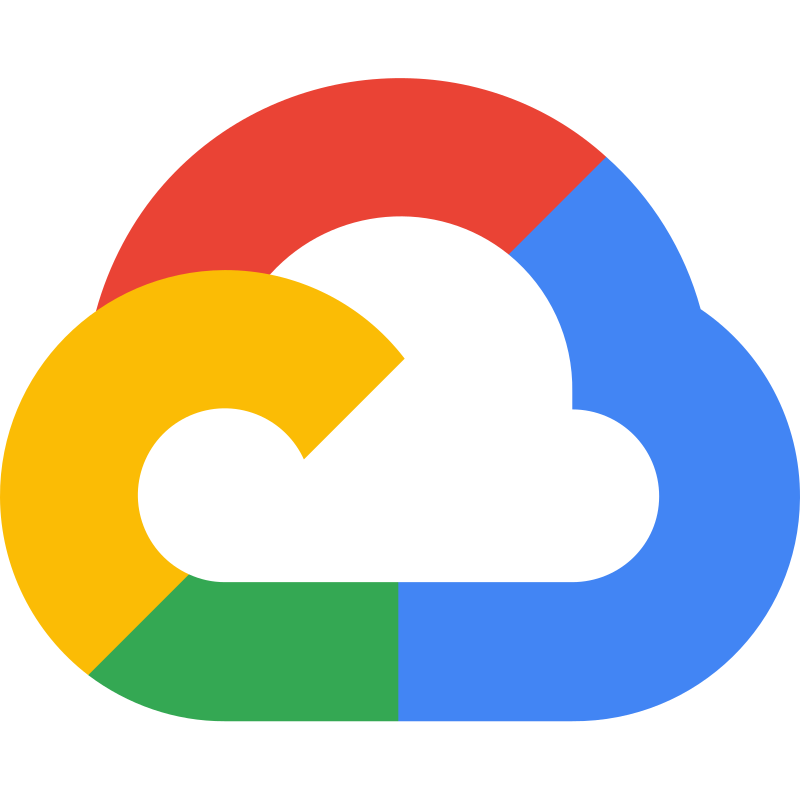

# Hello World! I'm Álvaro Maldonado 👋

**👨🏻‍💻 Senior Software Engineer | AI-Powered Engineer 🦾**

---

💼 **Years of experience:** +10 years

🏢 **Industries:**
- 📡 Telecommunications
- 💳 Financial Services
- 🏦 Pension Funds (AFP)
- 🛒 Retail
- 👥 Human Resources
- 🏛️ Government
- ✈️ Airlines
- 🤖 AI

---

## 🧔🏻‍♂️ About Me

I'm a Senior Software Engineer with a solid track record in developing and integrating technological solutions, participating in the entire software lifecycle. I've worked in various industries such as telecommunications, financial services, and more, taking on key roles: from Backend Developer and IT Consultant to Tech Lead and CTO.

Driven by technology and innovation, I am currently focusing my professional growth on Artificial Intelligence and Machine Learning, seeking challenges that connect purpose, impact, and growth.

### 🔎 Looking for:
- Challenging projects in AI & Machine Learning
- Strategic roles with remote work possibilities
- Teams where critical thinking and innovation are key

### 🤝 Why collaborate with me?
- Technical expertise in development, integration, and leadership
- Ability to connect technology with business goals
- High adaptability to remote work and results-oriented mindset

> Let's connect! I'm open to opportunities and collaborations that create real impact.

---

## 🛠️ Technical Skills

### 🧩 API Design

  
  

### 🕵️ Code Review

  
  
  

### 📋 Project Management

  
  

### 🎨 Frontend

  
  
  
  

### 🖥️ Backend

  
  
  
  
  
  

### 🗄️ Databases

  
  
  
  
  
  
  
  
  

### 🔧 Code Management

  
  
  

### 🏗️ Build Tools

  
  

### 🧪 Testing

  
  
  
  
  

### ♾️ CI/CD

  
  
  
  
  

### 📈 Monitoring

  
  
  

### ☁️ Cloud (AWS)

  
  
  
  
  
  
  
  
  
  
  
  
  
  
  

### 🤖 AI

  
  
  
  
  
  
  
  
  
  
  
  
  

---

## 💡 Soft Skills

- 🗣️ Communication
- 🤝 Teamwork
- 🧩 Problem Solving
- 🔄 Adaptability
- 🏅 Leadership
- ⏳ Time Management

---

## 🌐 Languages

- **🇪🇸 Spanish:** Native
- **🇺🇸 English:** B1-B2

---

## 📊 Stats

<!-- GitHub Stats and Most Used Languages -->

  
   
  
   
  

---

  
  

