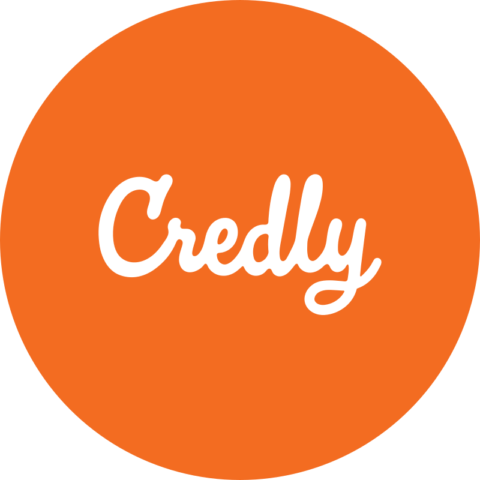
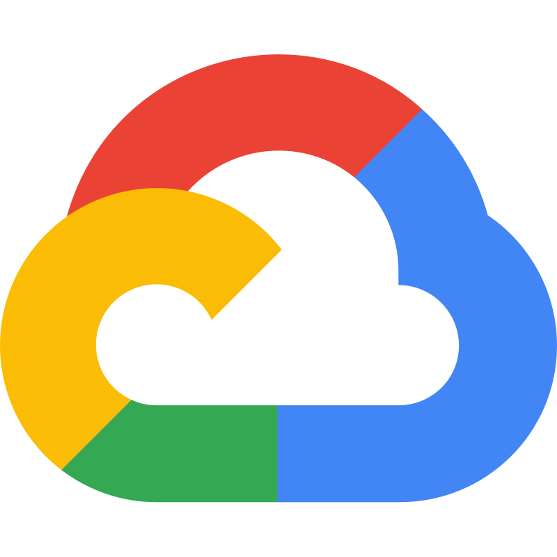

# Hello World! I'm Álvaro Maldonado 👋

## 🧔🏻‍♂️ About Me

I am a Senior Software Engineer with a solid 15-year track record leading projects across the entire software lifecycle. My passion is leveraging **Artificial Intelligence** to solve complex business problems and enhance team productivity. I embrace a **'Product Engineer'** mindset, focusing on deeply understanding the business 'why' before engineering the technical 'how'.

## 🚀 My Core Focus Areas

-   🧠 **Product Engineering & Strategy:** I serve as a bridge between business needs and technical solutions, ensuring that every line of code delivers tangible business value.
-   🤖 **AI-Powered Development:** I leverage AI to accelerate development, allowing me to focus on high-level architecture and complex problem-solving, not just implementation.
-   🏗️ **Software Architecture & Technical Leadership:** I design scalable and resilient systems and mentor teams to elevate quality standards and best practices.

## 💻 My Tech Stack

-   **Core Languages & Frameworks:** Java, Spring Boot, Python, FastAPI, JavaScript, React.
-   **AI / ML:** TensorFlow, PyTorch, LangChain, HuggingFace, OpenAI API, LLMs, RAG.
-   **Cloud Infrastructure & DevOps:** AWS, GCP, Docker, Kubernetes, Jenkins, GitHub Actions, Elasticsearch.
-   **Databases & Storage:** SQL, Oracle, PostgreSQL, MongoDB, JPA, Hibernate.
-   **Testing & Code Quality:** JUnit, Mockito, Sonar, Veracode, TDD, Shift-Left Testing.
-   **Agile Management & Methodologies:** Agile, Scrum, Jira, Confluence.
-   **Developer Tools & Version Control:** Git (GitHub, GitLab), Maven, Gradle, OpenAPI/Swagger.

## 📊 Stats

<!-- GitHub Stats and Most Used Languages -->

  
   
  
   
  

  
  

